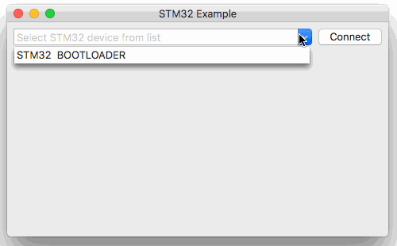
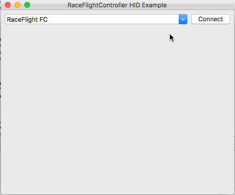
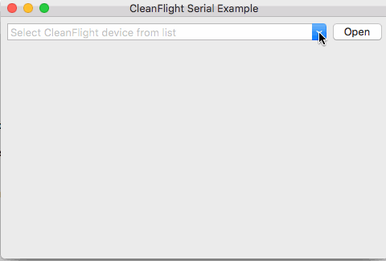

# USBDeviceSwift

**USBDeviceSwift** - is a wrapper for `IOKit.usb` and `IOKit.hid` and `IOKit.serial` written on pure Swift that allows you convenient work with USB devices.

<table>
    <tr>
        <th>
            
        </th>
        <th>
            
        </th>
    </tr>
    <tr>
         <th>
         
         </th>
    </tr>
</table>

Working with `IOKit.usb` and `IOKit.hid` and `IOKit.serial` on Swift is a pain. A lot of not converted C code, pointers make your life harder.
This library provides basic connect/disconnect events, converted functions to send and receive requests and examples.

## Getting Started

### Requirements

* Mac OS X 10.10
* Xcode 8+
* Swift 4

## Installation

#### CocoaPods

[CocoaPods](https://cocoapods.org/) is a dependency manager for Cocoa projects.

Specify USBDeviceSwift into your project's `Podfile`:

```ruby
# Uncomment the next line to define a global platform for your project
# platform :ios, '9.0'

target 'testusb' do
# Comment the next line if you're not using Swift and don't want to use dynamic frameworks
use_frameworks!

# Pods for testusb

pod 'USBDeviceSwift'

end
```

Then run the following command:

```bash
$ pod install
```

#### Swift Package Manager

[Swift Package Manager](https://swift.org/package-manager/)

```
import PackageDescription

let package = Package(
    name: "Example project",
    dependencies: [
        .Package(url: "https://github.com/Arti3DPlayer/USBDeviceSwift.git", majorVersion: 1),
    ]
)
```

## Examples

You will find all examples on Wiki page [here](https://github.com/Arti3DPlayer/USBDeviceSwift/wiki)

## License

This project is licensed under the MIT License - see the [LICENSE.md](LICENSE) file for details

## Change Log

This can be found in the [CHANGELOG.md](CHANGELOG.md) file.

